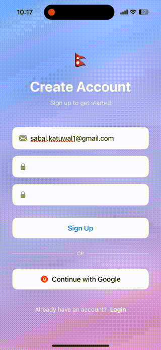

# KMM Firebase Authentication

A Kotlin Multiplatform Mobile (KMM) application demonstrating Firebase Authentication with shared business logic and a SwiftUI-based iOS UI, following Clean Architecture principles.

## Features

- Email & password sign-up
- Email & password login
- Logout functionality
- Google Sign-In
- Authentication state observation (logged in / logged out)
- Clean Architecture with domain, data, and presentation layers
- Platform-agnostic business logic in shared KMM module

## Demo

<p align="center">
  
</p>


## Project Structure

```
├── shared/                          # Kotlin Multiplatform shared module
│   └── src/
│       ├── commonMain/kotlin/com/example/firebaseauth/
│       │   ├── domain/
│       │   │   ├── model/           # AuthUser, AuthState, AuthResult
│       │   │   ├── repository/      # AuthRepository interface
│       │   │   └── usecase/         # SignUp, Login, Logout, GoogleSignIn use cases
│       │   ├── data/
│       │   │   ├── datasource/      # FirebaseAuthService
│       │   │   └── repository/      # AuthRepositoryImpl
│       │   ├── presentation/        # AuthViewModel, IOSAuthViewModel
│       │   ├── di/                  # ServiceLocator
│       │   └── util/                # FlowWrapper for iOS
│       └── iosMain/                 # iOS-specific implementations
│
├── iosApp/                          # iOS SwiftUI Application
│   └── iosApp/
│       ├── Views/                   # AuthView, HomeView
│       ├── ViewModels/              # AuthViewModelWrapper
│       └── Helpers/                 # GoogleSignInHelper
│
└── composeApp/                      # Android Compose Application (optional)
```

## Prerequisites

1. **Java JDK 11+** - Required for Gradle
   ```bash
   # Install via Homebrew on macOS
   brew install openjdk@17
   ```

2. **Xcode 15+** - For iOS development

3. **Android Studio** - For Android development (optional)

4. **Firebase Project** - Create at [Firebase Console](https://console.firebase.google.com)

## Firebase Setup

### Step 1: Create Firebase Project

1. Go to [Firebase Console](https://console.firebase.google.com)
2. Click "Create a project"
3. Follow the setup wizard

### Step 2: Enable Authentication Methods

1. In Firebase Console, go to **Authentication** > **Sign-in method**
2. Enable **Email/Password**
3. Enable **Google** (note the Web Client ID for later)

### Step 3: iOS Configuration

1. In Firebase Console, click the iOS icon to add an iOS app
2. Enter your Bundle ID (e.g., `com.example.firebaseauth`)
3. Download `GoogleService-Info.plist`
4. Place it in `/iosApp/iosApp/` folder
5. **Important:** Add the file to your Xcode project:
   - Open Xcode
   - Right-click on `iosApp` folder
   - Select "Add Files to iosApp"
   - Select `GoogleService-Info.plist`

### Step 4: Configure Google Sign-In URL Scheme

1. Open `GoogleService-Info.plist`
2. Find the `REVERSED_CLIENT_ID` value
3. The `Info.plist` already has a placeholder - update the Xcode build settings:
   - Add `REVERSED_CLIENT_ID` to your `Config.xcconfig` or build settings

## Running the iOS App

### Step 1: Open in Xcode

```bash
open /path/to/KMM/iosApp/iosApp.xcodeproj
```

> ⚠️ **Note:** Do NOT run `./gradlew :shared:embedAndSignAppleFrameworkForXcode` from terminal. This task is designed to be run by Xcode during the build process. Xcode will automatically compile the shared framework when you build the app.

### Step 2: Add Swift Package Dependencies in Xcode

1. Open `iosApp.xcodeproj` in Xcode
2. Go to **File** > **Add Package Dependencies**
3. Add the following packages:

   **Firebase iOS SDK:**
   - URL: `https://github.com/firebase/firebase-ios-sdk`
   - Version: `11.0.0` or later
   - Select: `FirebaseAuth`, `FirebaseCore`

   **Google Sign-In:**
   - URL: `https://github.com/google/GoogleSignIn-iOS`
   - Version: `8.0.0` or later
   - Select: `GoogleSignIn`, `GoogleSignInSwift`

### Step 3: Build and Run

1. Select your target device/simulator
2. Click **Run** (⌘R)

## Architecture Overview

### Clean Architecture Layers

1. **Domain Layer** (Platform-agnostic)
   - `AuthUser` - User model
   - `AuthState` - Authentication state (Loading, Authenticated, Unauthenticated)
   - `AuthResult` - Operation result wrapper
   - `AuthRepository` - Repository interface
   - Use Cases - Single-responsibility business operations

2. **Data Layer** (Platform-agnostic with GitLive Firebase)
   - `FirebaseAuthService` - Firebase SDK wrapper
   - `AuthRepositoryImpl` - Repository implementation

3. **Presentation Layer**
   - `AuthViewModel` - Shared ViewModel with StateFlow
   - `IOSAuthViewModel` - iOS-friendly wrapper

### iOS Architecture

- SwiftUI views observe `AuthViewModelWrapper`
- `AuthViewModelWrapper` wraps the KMM `IOSAuthViewModel`
- Uses `@Published` properties for reactive UI updates
- Native Google Sign-In handled by `GoogleSignInHelper`

## API Usage

### From iOS (Swift)

```swift
// Initialize ViewModel
@StateObject private var viewModel = AuthViewModelWrapper()

// Sign up
viewModel.signUp(email: "user@example.com", password: "password123")

// Login
viewModel.login(email: "user@example.com", password: "password123")

// Google Sign-In (after getting tokens)
viewModel.signInWithGoogle(idToken: idToken, accessToken: accessToken)

// Logout
viewModel.logout()

// Observe state
if viewModel.isAuthenticated {
    // User is logged in
    let user = viewModel.currentUser
}
```

### From Shared Kotlin

```kotlin
// Create ViewModel
val viewModel = AuthViewModel()

// Observe state
viewModel.uiState.collect { state ->
    when (state.authState) {
        is AuthState.Authenticated -> // Handle authenticated
        is AuthState.Unauthenticated -> // Handle unauthenticated
        is AuthState.Loading -> // Show loading
    }
}

// Perform actions
viewModel.signUp(email, password)
viewModel.login(email, password)
viewModel.logout()
```